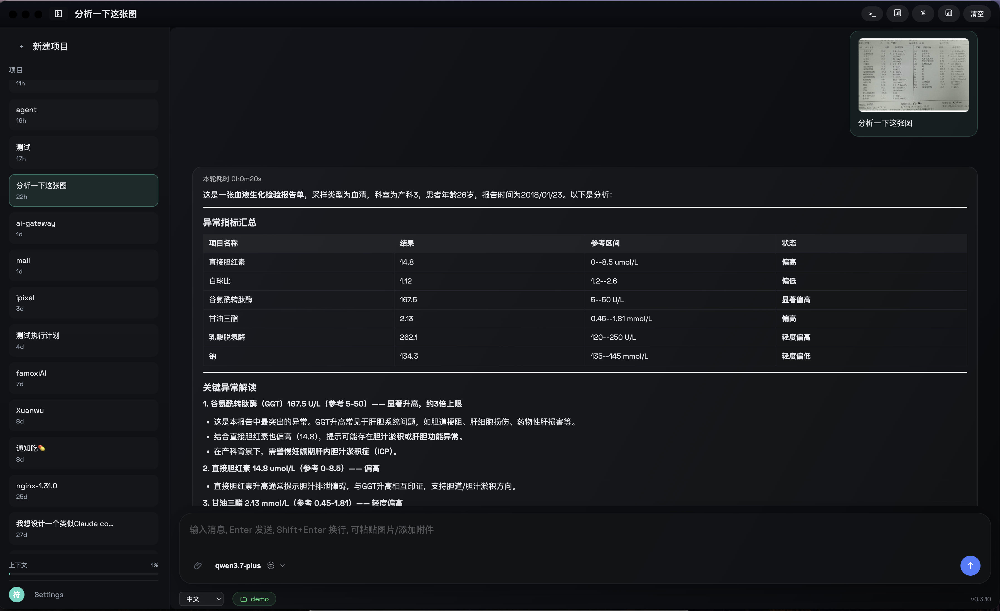

# Taco AI

**Taco AI** 是一款运行在桌面端的智能编程助手，与您共享同一台计算机环境，能够阅读代码、执行命令、操作文件、操控浏览器，帮助您完成开发、分析、排查等各类任务。

---

## 核心能力

| 能力 | 说明 |
|------|------|
| 代码阅读与修改 | 读取项目文件、编辑代码、重构模块，支持 18 种编程语言高亮 |
| 命令执行 | 在系统 Shell 中执行构建、测试、安装、Git 操作等命令 |
| 文件管理 | 列出目录结构、搜索文件、创建/删除/移动文件 |
| 浏览器自动化 | 操控外部浏览器进行页面导航、点击、表单填写、内容提取 |
| 图片理解 | 上传截图或图片，由大模型进行视觉分析与信息提取 |
| 终端集成 | 内嵌 xterm 终端，支持完整命令行交互 |
| 代码编辑器 | 内嵌 Monaco Editor，支持语法高亮与 Diff 对比 |
| 计划管理 | 多步骤任务自动规划、提案确认、进度跟踪 |
| 上下文记忆 | 跨会话记忆召回与回放，保持长对话连贯性 |
| 跨端同步 | 通过 WebSocket 桥接，桌面端状态实时同步到移动端 App |

---

## 多模型支持

Taco AI 接入多家大模型服务商，可根据任务需求灵活切换：

- DeepSeek
- 阿里千问 (Qwen)
- MiniMax
- 智谱 AI (GLM)
- 更多模型通过 AI Gateway 扩展

---

## 界面预览

<p align="center">
  
</p>

截图展示了 Taco AI 处理医疗报告图像分析的场景——上传一张血液生化检验报告单照片，AI 自动提取数据并整理为结构化表格，结合医学知识给出异常指标解读。

界面采用深色模式设计，分为三个核心区域：

- **左侧侧边栏** — 顶部"新建项目"按钮；历史会话列表（含时间标签）；底部显示上下文用量进度条、用户信息、"Settings"设置按钮、语言选择器（中文）和工作空间切换
- **中央主区域** — macOS 风格红黄绿窗口按钮；当前项目标题；AI 对话内容支持 Markdown 渲染、代码高亮、表格展示；右上角悬浮原始图片缩略图可点击预览
- **底部输入区** — 消息输入框（提示 Enter 发送 / Shift+Enter 换行 / 可粘贴图片）；附件上传按钮；模型选择器（当前 `qwen3.7-plus`）；蓝色圆形发送按钮

---

## 技术栈

### 桌面端
- **框架**: Electron 40 + React 18 + TypeScript
- **构建**: Vite 5 + esbuild
- **编辑器**: Monaco Editor
- **终端**: xterm.js + node-pty
- **GUI 自动化**: @nut-tree-fork/nut-js
- **Markdown**: react-markdown + remark-gfm
- **代码高亮**: highlight.js

### AI 网关
- **后端**: Go 1.22 + Gin + GORM + MySQL 8.4
- **前端管理**: React 19 + Ant Design 5 + Vite
- **认证**: JWT

---

## 快速开始

### 环境要求

- Node.js >= 18
- macOS / Windows / Linux

### 安装与运行

```bash
# 克隆仓库
git clone <仓库地址>
cd taco/desktop

# 安装依赖
npm install

# 开发模式启动（支持热更新）
npm run dev

# 打包发布
npm run dist
```

### AI Gateway（可选）

如果需要自建 AI 代理服务，参考 [ai-gateway/README.md](ai-gateway/README.md)。

---

## 项目结构

```
taco/
├── desktop/                    # Electron 桌面应用
│   ├── src/
│   │   ├── main/               # 主进程（Node.js）
│   │   │   ├── agent/          # AI 代理核心
│   │   │   ├── ai/             # LLM 客户端
│   │   │   ├── automation/     # 浏览器/桌面自动化
│   │   │   ├── bridge/         # 跨端同步桥接
│   │   │   ├── infrastructure/ # 基础设施（日志、终端、认证等）
│   │   │   ├── ipc/            # IPC 通信处理
│   │   │   ├── services/       # 业务服务（Agent 循环、记忆、工具等）
│   │   │   ├── tools/          # 工具定义与执行
│   │   │   └── window/         # 窗口管理与托盘
│   │   ├── preload/            # 预加载脚本
│   │   └── renderer/           # 渲染进程（React UI）
│   │       ├── views/          # 视图组件
│   │       ├── hooks/          # React Hooks
│   │       ├── styles/         # 样式文件
│   │       └── lib/            # 工具库
│   ├── build/                  # 应用图标资源
│   └── scripts/                # 构建脚本
├── ai-gateway/                 # AI 代理网关
│   ├── backend/                # Go 后端服务
│   ├── admin/                  # React 管理后台
│   └── docs/                   # API 文档
└── 截图.png                    # 应用截图
```

---

## 版本

当前版本：**v0.3.10**
