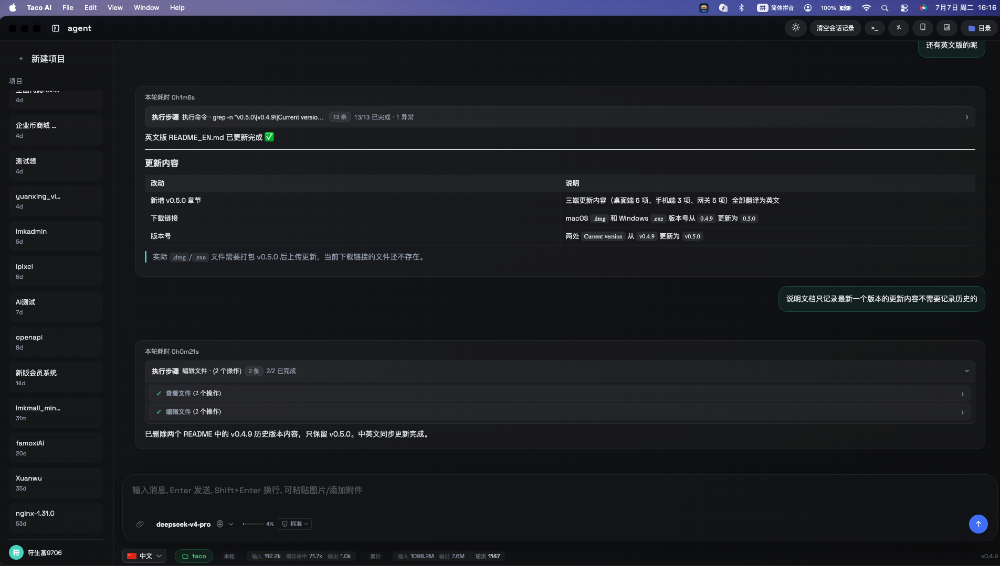
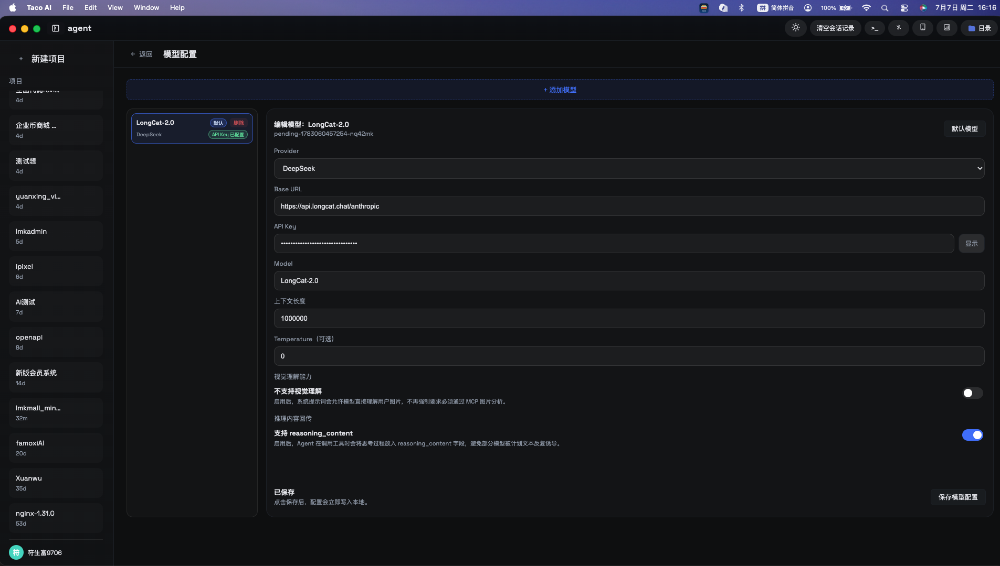
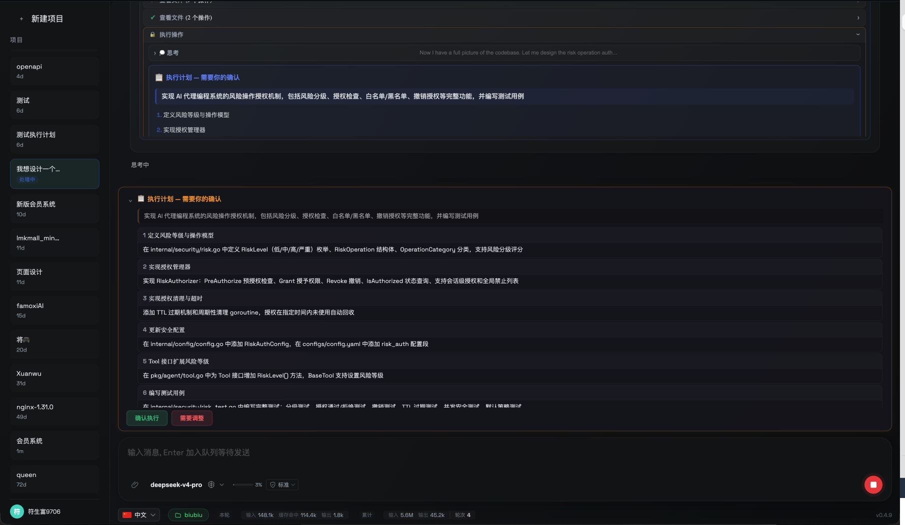
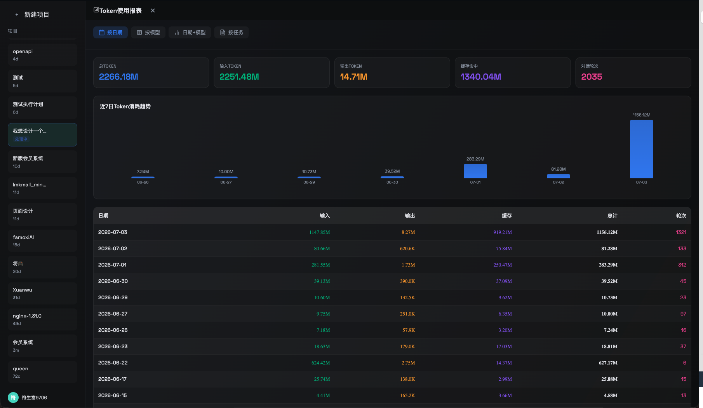
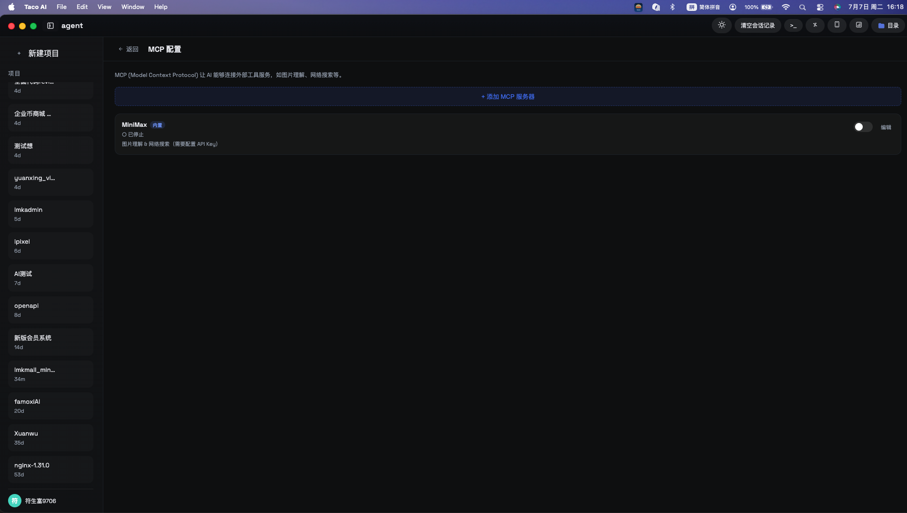
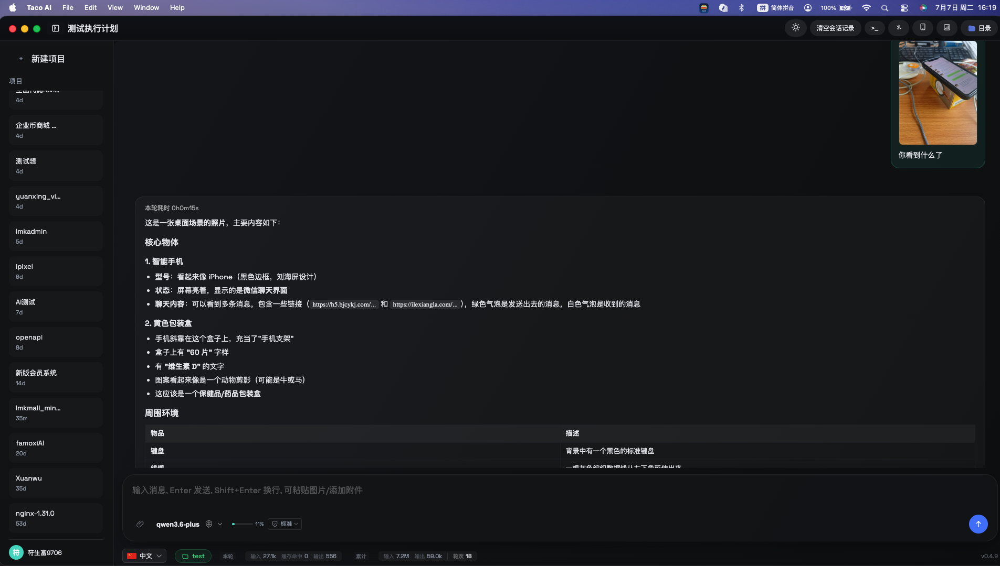
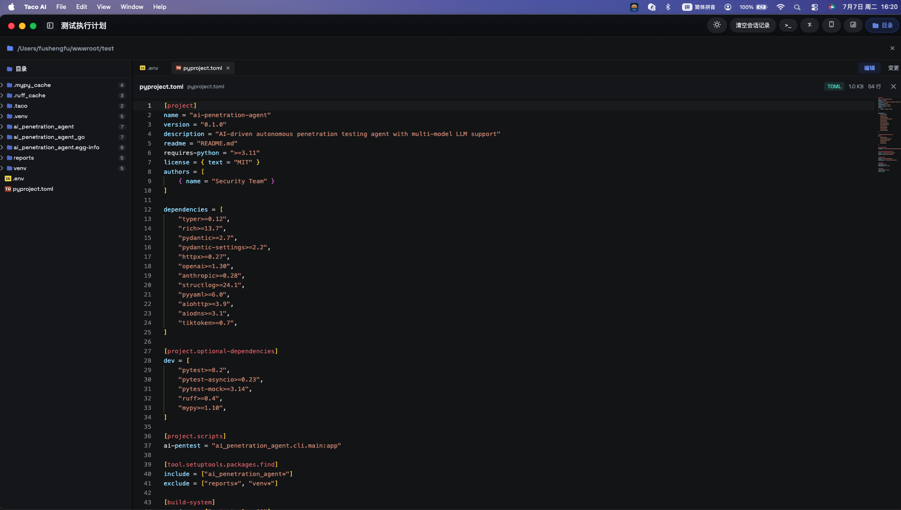
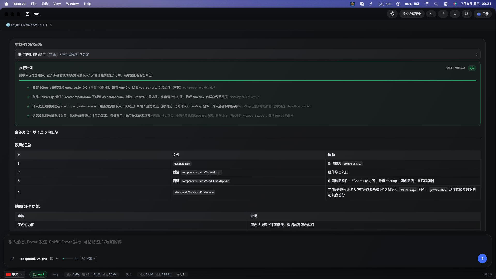
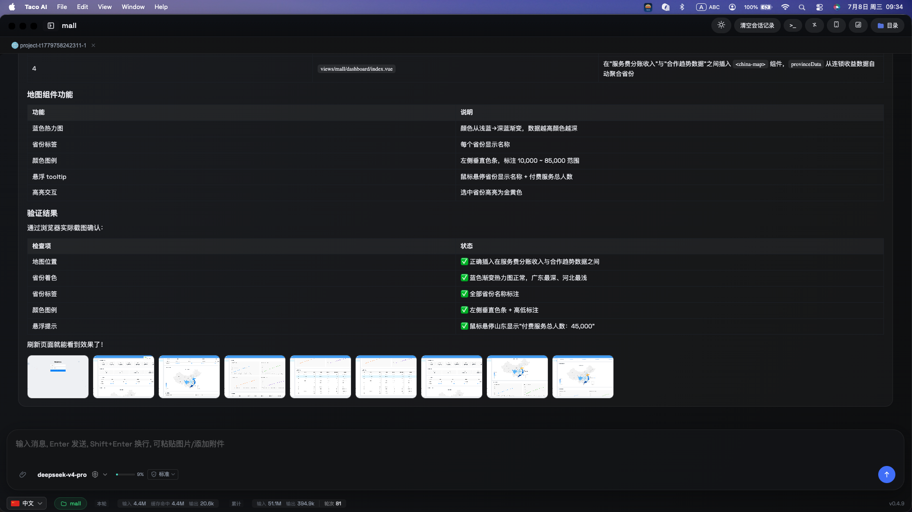

[English](README_EN.md) | 中文

# Taco AI

**Taco AI** 是一款运行在桌面端的智能编程助手，与您共享同一台计算机环境，能够阅读代码、执行命令、操作文件、操控浏览器，帮助您完成开发、分析、排查等各类任务。

---

## 核心能力

| 能力 | 说明 |
|------|------|
| 代码阅读与修改 | 读取项目文件、编辑代码、重构模块，支持 18 种编程语言高亮 |
| 命令执行 | 在系统 Shell 中执行构建、测试、安装、Git 操作等命令 |
| 文件管理 | 列出目录结构、搜索文件、创建/删除/移动文件 |
| 浏览器自动化 | 操控外部浏览器进行页面导航、点击、表单填写、内容提取 |
| 图片理解 | 上传截图或图片，由大模型进行视觉分析与信息提取 |
| 终端集成 | 内嵌 xterm 终端，支持完整命令行交互 |
| 代码编辑器 | 内嵌 Monaco Editor，支持语法高亮与 Diff 对比 |
| 计划管理 | 多步骤任务自动规划、提案确认、进度跟踪 |
| 上下文记忆 | 跨会话记忆召回与回放，保持长对话连贯性 |
| 跨端同步 | 通过 WebSocket 桥接，桌面端状态实时同步到移动端 App |

---

## v0.5.1 更新内容

### 技能系统重构

| 功能 | 说明 |
|------|------|
| 技能市场接入 | 对接腾讯 SkillHub（78.5K+ 技能）和 ClawHub（69.5K+ 技能），支持按分类搜索、预览和安装第三方技能 |
| 分类场景细化 | 分类体系从 6 类扩展到 12 大类（办公效率、开发编程、数据分析、AI Agent、内容创作等），对齐 SkillHub 标准 |
| 卡片预览与详情 | 搜索结果和已安装列表均支持点击卡片预览技能详情，侧边弹窗展示完整 SKILL.md 内容 |
| 搜索与已安装分离 | 发现技能和已安装列表 Tab 独立切换，搜索结果不再把已安装列表挤到底部 |
| 搜索体验优化 | 新增输入框清空按钮；分类筛选改为服务端 API 精准过滤，替代客户端关键词匹配 |
| 作者信息保留 | 安装技能时保留搜索结果中的作者名称，不再丢失显示为 Unknown |
| 来源标签简化 | 技能来源精简为"内置"和"第三方"两种，去掉冗余的"本地"分类 |
| 安装前安全审核 | 新增技能安全审核机制：检测危险指令（rm -rf / chmod / sudo / curl\|sh 等），分级处理（低/中直接安装，高需确认，致命直接拒绝） |

### 技能安全加固

| 功能 | 说明 |
|------|------|
| 命令注入修复 | `execRunSkillScript` 不再走 shell 执行，改用 `execFile` + 脚本名白名单校验，杜绝 `&&` / `;` / `\|` 等命令注入 |
| ZIP 解压前校验 | 安装技能时先校验 ZIP 内容清单（文件数 ≤ 200、单文件 ≤ 10MB、总大小 ≤ 50MB），拒绝危险文件类型和路径穿越条目 |
| ZIP slip 防护 | 新增 `validateExtractionPaths` 递归校验解压路径，拒绝符号链接和越界路径 |
| 重复代码消除 | 合并 `isClawHubSlug` / `buildClawHubDownloadUrl` / `downloadAndExtractZip` 三处重复实现 |
| 路径读取限制 | 禁止 AI 通过 `read_file` / `list_dir` 直接访问技能目录，强制使用 `read_skill` 专用工具 |
| 内置技能保护 | 内置技能不可卸载、不可被第三方覆盖，三层硬限制确保安全 |

### 路径解析修复

| 功能 | 说明 |
|------|------|
| 外部路径误判修复 | 修复 `resolveSafe` 将外部绝对路径（如 `~/.taco/skills/`）错误拼入工作空间的 bug，现在直接返回明确错误信息 |
| 类型不匹配修复 | 修复 `resolveSmartPath` 中目录被当文件读取后仍进入全量搜索的误导行为 |

### AI 网关

| 功能 | 说明 |
|------|------|
| 分页功能全面修复 | 修复后台管理 19 个页面中 12 个页面的分页 bug：`pageSize` 参数传递、state 同步、前后端默认值统一（10 条/页） |
| 分页页面覆盖 | Members / Accounts / Agents / Roles / Messages / AppVersions / Plans / Models / TokenStats / Sessions / Orders / Logs 全链路验证 |

---

## v0.5.2 更新内容

### 语音朗读（TTS）

| 功能 | 说明 |
|------|------|
| 只读最终回复 | 简化朗读逻辑，AI 处理任务过程中不再流式朗读中间内容，只播报最终回复 |
| 切项目自动停止 | 切换到其他项目时自动停止当前朗读，避免跨项目语音串扰 |
| 文本智能清洗 | 朗读前自动过滤 Markdown 表格分隔线、无意义符号碎片、纯英文短词，输出更自然流畅 |
| 设置面板完善 | 自动朗读开关、按语言分组的音色选择、语速调节（0.5x-2.0x）、音高调节、试听预览 |

### AI 语音头像特效

| 功能 | 说明 |
|------|------|
| 科幻能量核心 | 蓝色等离子能量球呼吸脉冲动画（三阶段：扩张→收缩→恢复），配合六层发光光晕 |
| 冲击波扩散 | 三层冲击波从核心依次向外扩散消失，间隔 0.8s 错峰播放 |
| 窗口居中 | 特效显示在窗口正中央，无遮罩、不阻挡任何交互操作 |
| 双主题适配 | 暗色/亮色主题独立配色方案，自动跟随系统主题切换 |

### 复制为图片

| 功能 | 说明 |
|------|------|
| Markdown 真实渲染 | 使用 `html2canvas` + `react-markdown` 技术方案，输出效果与聊天界面完全一致 |
| 格式完整保留 | 粗体、斜体、行内代码、代码块（含语言标签）、表格边框、引用块、链接颜色全部保留 |
| 2x 高清输出 | 720px 宽度 2 倍渲染，图片清晰锐利 |
| 双主题 | 自动跟随当前暗色/亮色主题配色 |

### 复制按钮增强

| 功能 | 说明 |
|------|------|
| IPC 降级通道 | `navigator.clipboard.writeText` 在 Electron `file://` 协议下可能不可用，失败时自动降级为 Electron 原生剪切板 API |
| 剪切板图片通道 | 新增 `CLIPBOARD_WRITE_TEXT` / `CLIPBOARD_WRITE_IMAGE` 双通道 IPC，覆盖文本和图片复制场景 |

### Bug 修复

| 功能 | 说明 |
|------|------|
| 亮色主题特效失效 | 修复语音头像在亮色主题下仍显示暗色配色的 bug（`.theme-light` class 选择器改为 `:root[data-theme='light']` 属性选择器） |

---

## 多模型支持

Taco AI 接入多家大模型服务商，可根据任务需求灵活切换：

- DeepSeek
- 阿里千问 (Qwen)
- MiniMax
- 智谱 AI (GLM)
- 更多模型通过 AI Gateway 扩展

---

## 界面预览

### 对话与任务执行

<p align="center">
  
</p>

AI 对话主界面，展示完整的多轮任务执行记录。图中 AI 正在执行文档更新任务——将 v0.5.0 版本更新内容翻译并写入英文版 README，随后按用户要求删除历史版本内容。每个任务以卡片形式展示，包含耗时、执行步骤（查看文件、编辑文件等）、完成状态（绿色对勾 ✓），以及操作结果摘要表格。右侧为用户消息气泡。深色模式三栏布局：

- **左侧边栏** — "新建项目"按钮；历史项目列表（含时间标签）；底部用户头像、语言选择器
- **中央主区域** — AI 任务执行记录：步骤明细 + 结果表格 + 注意事项（红色竖线标注）
- **底部输入区** — 消息输入框（支持粘贴图片 / 附件）；当前模型 `deepseek-v4-pro`；发送按钮；Token 统计信息

### 模型配置

<p align="center">
  
</p>

设置面板中的模型配置页，支持多模型管理与自定义参数。当前编辑模型为 **LongCat-2.0**，配置项包括：

- **Provider** — 服务商（DeepSeek）
- **Base URL / API Key** — 接口地址与认证密钥（API Key 支持显隐切换）
- **Model** — 模型标识符
- **上下文长度** — 支持 1,000,000 tokens 超长上下文
- **Temperature** — 采样温度，设为 0 表示确定性输出
- **高级能力开关** — 视觉理解能力（关闭）、reasoning_content 推理字段回传（开启）

顶部 "添加模型" 按钮支持接入新模型，"默认模型" 按钮可设为首选。

### 计划管理

<p align="center">
  
</p>

AI 代理任务规划界面，展示结构化执行计划的生成与审批流程。AI 将复杂任务"实现 AI 代理编程系统的风险操作授权机制"自动拆解为 6 个技术步骤——定义风险等级与操作模型、实现授权管理器、授权清理与 TTL 超时、更新安全配置、Tool 接口扩展风险等级、编写测试用例——每个步骤附带详细说明。底部提供 **"确认执行"** 和 **"需要调整"** 按钮，用户可在 AI 动手修改代码前审核方案，确保每一步都符合预期。顶部显示 token 用量统计。

### 统计分析

<p align="center">
  
</p>

Token 使用统计仪表板，帮助用户掌握大模型 API 调用成本与使用趋势。核心指标卡片展示**总 Token（2266M）、输入/输出 Token、缓存命中量**及**对话轮次（2035）**；近 7 日消耗趋势柱状图直观呈现用量变化；底部数据明细表按日期列出每日输入、输出、缓存、总计及轮次，支持按日期、模型、任务等多维度筛选，方便成本核算与异常排查。

### MCP 配置

<p align="center">
  
</p>

设置面板中的 MCP（Model Context Protocol）配置页，用于管理 AI 连接的外部工具服务。当前配置了 **MiniMax（内网）** 服务器，提供图片理解与网络搜索能力，状态为"已停止"。用户可通过开关一键启停服务，或点击"编辑"修改 API Key 等参数。顶部 "+ 添加 MCP 服务器" 按钮支持接入更多外部工具。

### 图片理解

<p align="center">
  
</p>

AI 多模态视觉分析界面。用户上传一张桌面场景照片（含手机、黄色维生素 D 包装盒、键盘等），AI 自动识别并详细描述核心物体——智能手机（亮屏显示微信聊天界面，包含 h5.bjcykj.com 等链接）、包装盒（"60 片"、"维生素 D"、动物剪影图案）。右侧悬浮原始图片缩略图方便随时比对。当前使用 `qwen3.6-plus` 模型。

### 代码编辑器

<p align="center">
  
</p>

内嵌 Monaco Editor 代码编辑界面，展示 Python 项目配置文件 `pyproject.toml` 的编辑场景。左侧为目录树文件浏览器（含 `.venv`、`ai_penetration_agent` 等），中央为 TOML 语法高亮编辑器（项目元数据、依赖项、脚本入口、构建系统），右侧为代码结构大纲导航。顶部标签页支持多文件切换，底部状态栏显示文件类型（TOML）、大小（1.0 KB）、行数（54 行），以及当前工作空间路径。

### 自动任务规划

<p align="center">
  
</p>

AI 自动任务规划与执行界面，展示从需求到交付的完整闭环。用户提出"封装中国地图组件"后，AI 自动完成：安装 ECharts 依赖（echarts@4.9.0 + vue-echarts）、创建 `ChinaMap.vue` 组件（含热力图、悬浮 tooltip、颜色图例、自适应容器）、集成到 dashboard 页面。右侧执行计划面板展示 75 条执行步骤与进度（0h10m31s），底部改动汇总表格列出 4 个被修改的文件及具体改动内容。当前使用 `deepseek-v4-pro` 模型。

### 自动截图验证

<p align="center">
  
</p>

AI 完成网页开发后自动截图验证界面。左上方列出 5 项功能清单（蓝色热力图、省份标签、颜色图例、悬浮 tooltip、高亮交互），AI 通过浏览器自动截图逐一验证每项功能——地图位置、省份着色、省份标签、颜色图例、悬浮提示——全部标记绿色对勾 ✅。底部展示 8 张渲染效果缩略图作为视觉证据。AI 无需人工介入，从写代码到打开浏览器截图验证一气呵成。

---

### 跨端同步演示

<p align="center">
  <a href="49.mp4" target="_blank">点击观看 Taco AI 移动端 App 操作演示视频</a>
</p>

---

## 下载安装

无需克隆源码，直接下载对应平台安装包即可使用。

### 中国区域用户

以下链接托管于中国大陆服务器，国内用户可直接高速下载：

| 平台 | 下载链接 | 安装说明 |
|------|---------|---------|
| **macOS** (Apple Silicon) | [Taco AI-0.5.2-arm64.dmg](https://store.bjctykj.com/app-versions/macOS/1784263710_Taco_AI-0.5.2-arm64.dmg) | 双击 `.dmg` 挂载后拖入 `Applications` 文件夹 |
| **Windows** (x64) | [Taco AI-0.5.2-x64.exe](https://store.bjctykj.com/app-versions/Windows/1784264609_Taco_AI-0.5.2-x64.exe) | 双击 `.exe` 按安装向导完成安装 |

### 海外用户

海外用户请从 [GitHub Releases](https://github.com/Fushengfu/tacoai/releases) 页面下载对应平台的安装包。

当前版本：**v0.5.2**

> 源码构建请参考下方 [快速开始](#快速开始)。

---

## 技术栈

### 桌面端
- **框架**: Electron 40 + React 18 + TypeScript
- **构建**: Vite 5 + esbuild
- **编辑器**: Monaco Editor
- **终端**: xterm.js + node-pty
- **GUI 自动化**: @nut-tree-fork/nut-js
- **Markdown**: react-markdown + remark-gfm
- **代码高亮**: highlight.js

### AI 网关
- **后端**: Go 1.22 + Gin + GORM + MySQL 8.4
- **前端管理**: React 19 + Ant Design 5 + Vite
- **认证**: JWT

---

## 快速开始

### 环境要求

- Node.js >= 18
- macOS / Windows / Linux

### 安装与运行

```bash
# 克隆仓库
git clone <仓库地址>
cd taco/desktop

# 安装依赖
npm install

# 开发模式启动（支持热更新）
npm run dev

# 打包发布
npm run dist
```

### AI Gateway（可选）

如果需要自建 AI 代理服务，参考 [ai-gateway/README.md](ai-gateway/README.md)。

---

## 项目结构

```
taco/
├── desktop/                    # Electron 桌面应用
│   ├── src/
│   │   ├── main/               # 主进程（Node.js）
│   │   │   ├── sdk/agent/      # AI 代理核心（LLM、工具、记忆、提示词）
│   │   │   │   ├── llm/        # LLM 客户端（多协议适配）
│   │   │   │   ├── tools/      # 工具定义、注册与执行
│   │   │   │   ├── memory/     # 记忆存储、召回与维护
│   │   │   │   ├── context/    # 上下文构建与压缩
│   │   │   │   └── prompt/     # 系统提示词构建
│   │   │   ├── services/       # 业务服务层
│   │   │   ├── infrastructure/ # 基础设施（日志、终端、认证、更新等）
│   │   │   ├── repositories/   # 数据持久化（SQLite）
│   │   │   ├── ipc/            # IPC 通信处理
│   │   │   ├── bridge/         # 跨端同步桥接
│   │   │   └── window/         # 窗口管理与托盘
│   │   ├── preload/            # 预加载脚本
│   │   └── renderer/           # 渲染进程（React UI）
│   │       ├── views/          # 视图组件（对话、编辑器、设置）
│   │       ├── hooks/          # React Hooks
│   │       ├── styles/         # 样式文件
│   │       └── lib/            # 工具库
│   ├── build/                  # 应用图标资源
│   └── scripts/                # 构建脚本
├── ai-gateway/                 # AI 代理网关
│   ├── backend/                # Go 后端服务
│   ├── admin/                  # React 管理后台
│   └── docs/                   # API 文档
└── 1.png 2.png 3.png 4.png 5.png 6.png 7.png 8.png 9.png 49.mp4  # 截图与演示视频
```

---

## 联系与反馈

- **作者邮箱**：[shengfu8161980541@qq.com](mailto:shengfu8161980541@qq.com)
- **GitHub Issues**：[github.com/Fushengfu/tacoai/issues](https://github.com/Fushengfu/tacoai/issues)
- **Gitee Issues**：[gitee.com/fushengfu/tacoai/issues](https://gitee.com/fushengfu/tacoai/issues)
- **许可证**：本项目基于 [Apache License 2.0](LICENSE) 开源

---

## 版本

当前版本：**v0.5.2**
