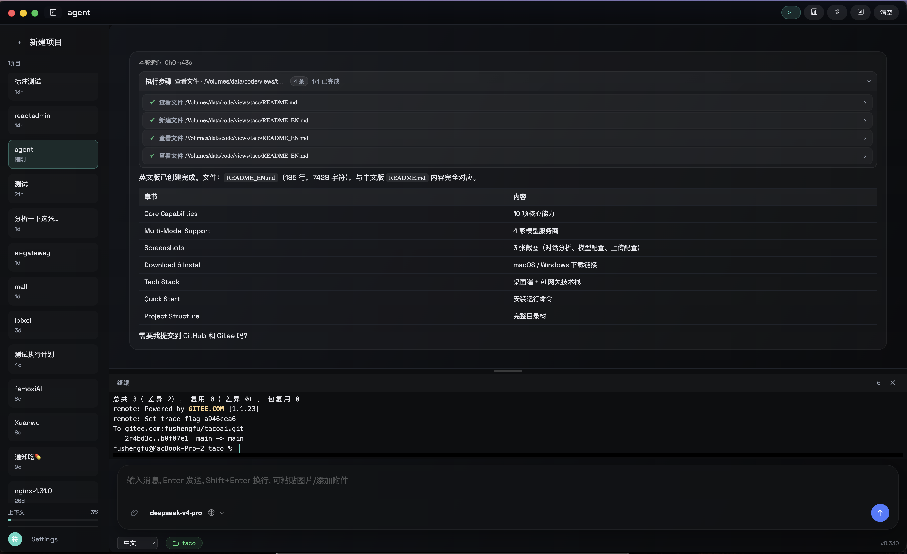
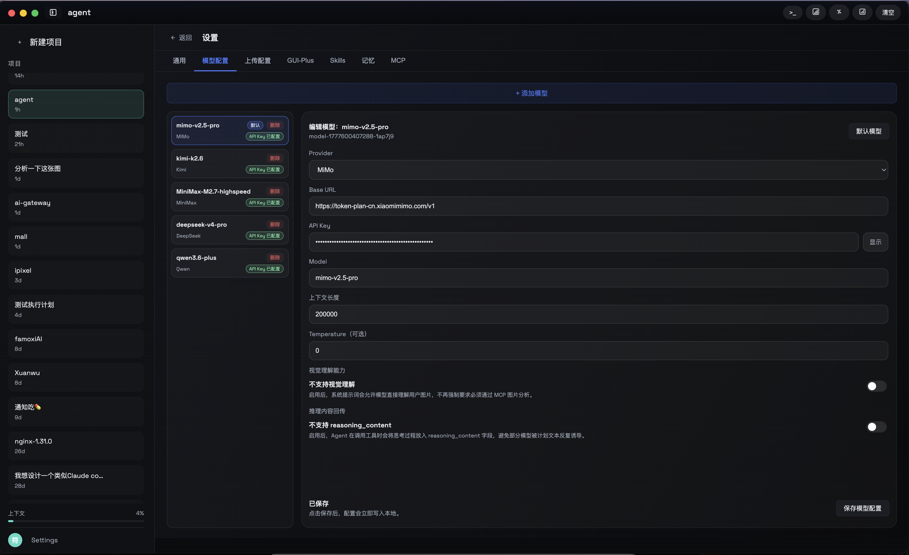
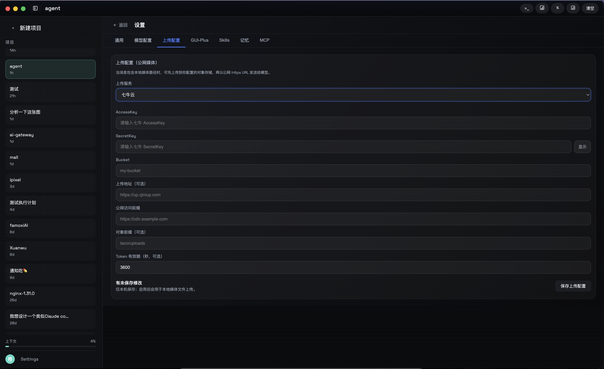
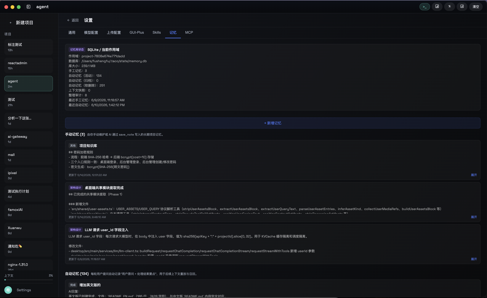

[中文](README.md) | English

# Taco AI

**Taco AI** is a desktop-based intelligent assistant that shares your computer environment. It can read code, execute commands, manipulate files, control browsers, and help you complete development, analysis, debugging, and various other tasks.

---

## Core Capabilities

| Capability | Description |
|------------|-------------|
| Code Reading & Editing | Read project files, edit code, refactor modules, with syntax highlighting for 18+ languages |
| Command Execution | Run build, test, install, Git operations and other commands in the system shell |
| File Management | List directory structure, search files, create/delete/move files |
| Browser Automation | Control external browsers for page navigation, clicking, form filling, and content extraction |
| Image Understanding | Upload screenshots or images for visual analysis and information extraction by LLMs |
| Terminal Integration | Built-in xterm terminal with full command-line interaction support |
| Code Editor | Built-in Monaco Editor with syntax highlighting and diff comparison |
| Plan Management | Automatic multi-step task planning, proposal confirmation, and progress tracking |
| Context Memory | Cross-session memory recall and replay for long conversation continuity |
| Cross-device Sync | Real-time desktop state synchronization to mobile app via WebSocket bridge |

---

## Multi-Model Support

Taco AI integrates with multiple LLM providers, switchable based on task requirements:

- DeepSeek
- Alibaba Qwen
- MiniMax
- Zhipu AI (GLM)
- More models extensible via AI Gateway

---

## Screenshots

### Conversation & Analysis

<p align="center">
  
</p>

The main AI conversation interface demonstrating multimodal analysis capabilities. A user uploads a blood biochemistry report photo; the AI performs OCR to extract data, organizes it into a structured Markdown table, and provides abnormal indicator interpretation with obstetric context — e.g., GGT 167.5 (≈3× upper limit) suggesting risk of intrahepatic cholestasis of pregnancy (ICP), direct bilirubin 14.8 elevated, etc. An original image thumbnail floats in the upper-right corner for convenient reference.

Dark mode three-column layout:

- **Left Sidebar** — "New Project" button; historical conversation list (with timestamps like `11h`, `agent`, `测试`, `分析一下这张图`); context usage progress bar, language selector (Chinese), and settings entry at the bottom
- **Central Main Area** — Structured AI responses: abnormal indicator summary table + in-depth pathological analysis; top toolbar (code view, table view, split comparison, clear)
- **Bottom Input Area** — Message input box (supports pasting images / attachments); current model `qwen3.7-plus`; blue circular send button

### Task Execution & Terminal

<p align="center">
  
</p>

The AI workbench task execution interface, demonstrating a complete automated workflow. The AI reads the Chinese README and generates an English version `README_EN.md` in 0h0m43s, with each operation step (viewing files, creating files, etc.) recorded with its path and status. Results are presented in a table comparing key sections (Core Capabilities, Multi-Model Support, Tech Stack, etc.) between the two versions. After completing the task, the AI proactively asks whether to push to GitHub and Gitee.

The embedded terminal below shows real-time Git push logs (to `gitee.com:fushengfu/tacoai.git` on the `main` branch). The bottom model selector has been switched to `deepseek-v4-pro`, and the status bar shows language selection, current workspace (`taco`), and version `v0.3.10`.

### Model Configuration

<p align="center">
  
</p>

The model configuration page in the settings panel, supporting multi-model management and custom parameters. The left model list includes `mimo-v2.5-pro` (default), `kimi-k2.6`, `MiniMax-M2.7-highspeed`, `deepseek-v4-pro`, `qwen3.6-plus` and other integrated models, with each entry showing provider name and API Key configuration status. The right detail panel allows item-by-item configuration of:

- **Provider / Base URL / API Key** — Provider and endpoint configuration
- **Model ID** — Model identifier
- **Context Length** — Supports up to 200,000 tokens ultra-long context
- **Temperature** — Sampling temperature; set to 0 for deterministic output
- **Advanced Toggles** — Visual understanding, reasoning_content field control

The top "Add Model" button supports integrating new models, and the upper-right toolbar provides quick access to terminal, statistics panel, and more.

### Upload Configuration

<p align="center">
  
</p>

The upload configuration page in the settings panel, used to upload local media files to object storage and generate HTTPS URLs for AI model access. Qiniu Cloud is currently selected, with configurable options including:

- **AccessKey / SecretKey** — Cloud storage authentication credentials (SecretKey supports show/hide toggle)
- **Bucket** — Storage bucket name
- **Upload Endpoint** — Optional custom upload endpoint
- **Public Access Prefix** — CDN or access domain name
- **Object Prefix / Token Expiry** — Directory organization and credential expiration time (default 3600s)

A "Unsaved changes, saved locally only" notice appears at the bottom. Once saved, images can be pasted or selected for upload during conversations.

### Memory Management

<p align="center">
  
</p>

The memory management page in the settings panel, managing the AI's long-term and short-term project knowledge. Storage engine is SQLite, database size 239.1 MB, with statistics overview: 3 manual memories, 134 active / 0 archived automatic memories, 251 soft-deleted, last updated June 2026.

Memory entries are divided into two categories:

- **Manual Memories** — Core knowledge explicitly saved by the user or AI (e.g., password encryption rules SHA-256 + bcrypt, desktop shared module architecture refactoring progress, LLM request user_id field injection design), each with category tags and expand button
- **Automatic Memories** — Task summaries automatically extracted by the system from conversations (e.g., "Added English README" completion summary), with detail view support

The top "+ Add Memory" button allows manual addition of project knowledge.

---

### Cross-device Sync Demo

<p align="center">
  <video controls width="800" src="49.mp4"></video>
  <br/>
  <em>Taco AI mobile app operation demo</em>
</p>

---

## Download & Install

No need to clone the source code — download the installer for your platform directly.

| Platform | Download Link | Installation |
|----------|---------------|--------------|
| **macOS** (Apple Silicon) | [Taco AI-0.3.10-arm64.dmg](https://store.huiyuanjia.net/Taco%20AI-0.3.10-arm64.dmg) | Double-click the `.dmg`, then drag into the `Applications` folder |
| **Windows** (x64) | [Taco AI Setup 0.3.10.exe](https://store.huiyuanjia.net/Taco%20AI%20Setup%200.3.10.exe) | Double-click the `.exe` and follow the installation wizard |

Current version: **v0.3.10**

> For building from source, see [Quick Start](#quick-start) below.

---

## Tech Stack

### Desktop
- **Framework**: Electron 40 + React 18 + TypeScript
- **Build**: Vite 5 + esbuild
- **Editor**: Monaco Editor
- **Terminal**: xterm.js + node-pty
- **GUI Automation**: @nut-tree-fork/nut-js
- **Markdown**: react-markdown + remark-gfm
- **Code Highlighting**: highlight.js

### AI Gateway
- **Backend**: Go 1.22 + Gin + GORM + MySQL 8.4
- **Frontend Admin**: React 19 + Ant Design 5 + Vite
- **Authentication**: JWT

---

## Quick Start

### Prerequisites

- Node.js >= 18
- macOS / Windows / Linux

### Install & Run

```bash
# Clone the repository
git clone <repository-url>
cd taco/desktop

# Install dependencies
npm install

# Start in development mode (with hot reload)
npm run dev

# Build for distribution
npm run dist
```

### AI Gateway (Optional)

To set up a self-hosted AI proxy service, refer to [ai-gateway/README.md](ai-gateway/README.md).

---

## Project Structure

```
taco/
├── desktop/                    # Electron desktop application
│   ├── src/
│   │   ├── main/               # Main process (Node.js)
│   │   │   ├── agent/          # AI agent core
│   │   │   ├── ai/             # LLM client
│   │   │   ├── automation/     # Browser/desktop automation
│   │   │   ├── bridge/         # Cross-device sync bridge
│   │   │   ├── infrastructure/ # Infrastructure (logger, terminal, auth, etc.)
│   │   │   ├── ipc/            # IPC communication handlers
│   │   │   ├── services/       # Business services (agent loop, memory, tools, etc.)
│   │   │   ├── tools/          # Tool definitions and execution
│   │   │   └── window/         # Window management and tray
│   │   ├── preload/            # Preload scripts
│   │   └── renderer/           # Renderer process (React UI)
│   │       ├── views/          # View components
│   │       ├── hooks/          # React Hooks
│   │       ├── styles/         # Stylesheets
│   │       └── lib/            # Utility libraries
│   ├── build/                  # App icon resources
│   └── scripts/                # Build scripts
├── ai-gateway/                 # AI proxy gateway
│   ├── backend/                # Go backend service
│   ├── admin/                  # React admin panel
│   └── docs/                   # API documentation
└── 1.png 2.png 3.png 4.png 5.png 49.mp4  # Screenshots & demo video
```

---

## Contact & Feedback

- **Author Email**: [shengfu8161980541@qq.com](mailto:shengfu8161980541@qq.com)
- **GitHub Issues**: [github.com/Fushengfu/tacoai/issues](https://github.com/Fushengfu/tacoai/issues)
- **Gitee Issues**: [gitee.com/fushengfu/tacoai/issues](https://gitee.com/fushengfu/tacoai/issues)
- **License**: This project is open-sourced under the [Apache License 2.0](LICENSE)

---

## Version

Current version: **v0.3.10**
